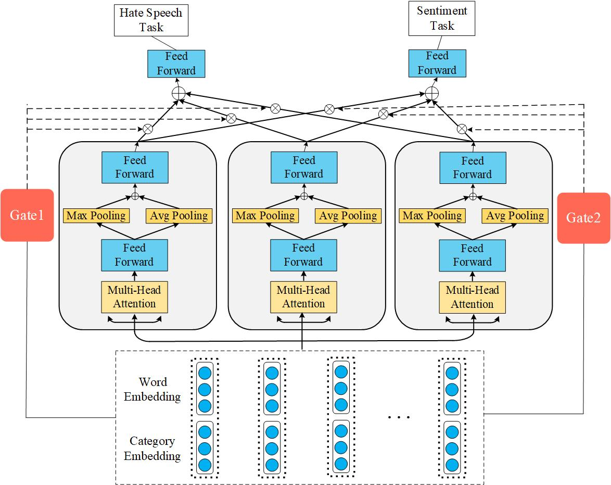

  

<!-- Title -->
<h1 align="center"><b>CS221 - Natural Language Processing</b></h1>

## Tabel of contents
* [ Lecturer](#lecturer)
* [ Member](#member)
* [ Project](#project)
## Lecturer

**Ph.D. Nguyen Thi Quy**

## Member

|**ID**|**Student ID**|**Name**|**Email**|
| ------ |-------------|----------------------|-------------------------|
| 1      | 21522295   	 |Le Tran Bao Loi|21522295@gm.uit.edu.vn|
| 2      | 21522110   	 |Bui Manh Hung|21522110@gm.uit.edu.vn|
| 3      | 21522487 	 |Bui Dinh Quan|21522487@gm.uit.edu.vn|
| 4      | 21522621      |Huynh Cong Thien|21522621@gm.uit.edu.vn|
| 5      | 21522706      |Nguyen Minh Tri|21522621@gm.uit.edu.vn|

## Project

# SKS
This repository provides code for the paper "Hate Speech Detection based on Sentiment Knowledge Sharing"

# Requirements
Python = 3.9
# Run project on colab
**How to run:** run file **NLP_finalproject.ipynb** in folder colab

## Data
- ## **_Download models here !!! [MODELS](https://drive.google.com/drive/folders/16p85gSCjGhZsL0j8AR7ieuhlT5l2VQjX?usp=sharing)_**
- ## **_Don't care about the data below; just download it here!!! [DATA-SKS](https://drive.google.com/drive/folders/1-6Lq1WDZJaZkCOjfAT0RAekx88go0si5?usp=sharing)_**

- ### SemEval data-set
  [SemEval2019 dataset train+dev](https://github.com/cicl2018/HateEvalTeam/tree/master/Data%20Files/Data%20Files) 
  [SemEval2019 dataset test](https://github.com/matteobrv/repro-SKS/blob/master/data/semeval_data/df_test.csv)
- ### Davidson data-set
  [Davidson data-set](https://github.com/t-davidson/hate-speech-and-offensive-language/tree/master/data)

- ### Sentiment data-setr

    We provide the training data-set used for the sentiment analysis task `train_E6oV3lV.csv`. The original training- and test-set are freely available on [Kaggle](https://www.kaggle.com/dv1453/twitter-sentiment-analysis-analytics-vidya).

- ### Dictionary of derogatory words

    We rely on the same dictionary of derogatory words `word_all.txt` compiled by the original authors.

The SE dataset may need some adjustment in formatting from tsv to csv. Make sure to put these in the data directory and also within their respective directory too. ex: `SemEval_task5/df_test.csv`

The glove txt file can be downloaded [here](https://www.kaggle.com/datasets/aellatif/glove6b300dtxt). There is also a larger one available, but make sure to adjust the script for it [here](https://www.kaggle.com/datasets/authman/pickled-glove840b300d-for-10sec-loading)
# Usage
## **Train**
`python train.py -d path_data_train --trial path_data_test -s ..\train_E6oV3lV.csv --word_list  ..\word_all.txt --emb ..\glove.6B.300d.txt -o ..\output_dir -b 512 --epochs 60 --lr 0.002 --maxlen 50 -t HHMM_transformer
`
## **Test**
`python inference.py --word_list ..\word_all.txt  --maxlen 50 --vocab-path ..\vocab.pkl`
## **Demo**
https://github.com/bmhungqb/SKS/assets/117832185/6501fad5-abc8-45a8-ac29-2bab0242fc49

